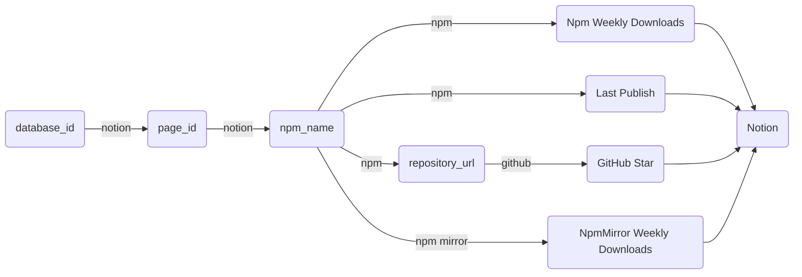

# Public Database

- [Public Database](#public-database)
  - [Npm Packages](#npm-packages)
  - [API](#api)

## Npm Packages

[Charts](https://public-database-charts.imzbb.cc/)
[Database](https://zhengbangbo.notion.site/75dc1174b0394f04acde30a004683f68?v=f6eac247a5be498d8387ad3febdbd548)



## API

- [Notion API](https://developers.notion.com/reference)
- [GITHUB REST API](https://docs.github.com/en/rest)
  - [**Rate limits**](https://docs.github.com/en/rest/overview/resources-in-the-rest-api?apiVersion=2022-11-28#rate-limiting)
- [NPM API](./src/api/npm.ts)
- [Npm Mirror API](./src/api/npmmirror.ts)

## Q&A

### `sh: tsc: command not found`

```bash
npm i -g typescript
```      

### `@notionhq/client warn: request fail { code: 'unauthorized', message: 'API token is invalid.' }`

```bash
cp .env.example .env
```

打开 https://www.notion.so/my-integrations ，打开 Notion 集成页面，登录自己的账号，点击 New integration 创建一个新的应用

