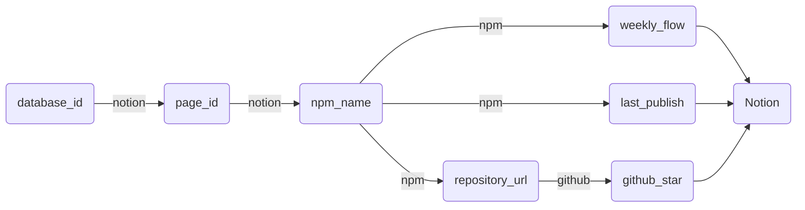

# Component Library List

[Read the list!](https://elastic-rate-cd3.notion.site/75dc1174b0394f04acde30a004683f68?v=f6eac247a5be498d8387ad3febdbd548)

## Data Flow

## Reference

- [Notion API](https://developers.notion.com/reference)
- [REST API](https://docs.github.com/en/rest)
- [NPM API](../src/api/npm.ts)
